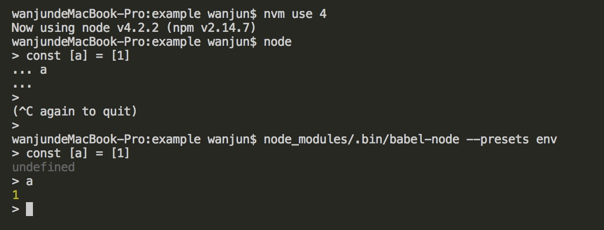

babel-node
===== 

也是 babel-cli 下面的一个 command，主要是实现了 node **执行脚本**和**命令行写代码**的能力。eg:

1. 执行脚本


``` js
// jsx.js
const React = require('react');
const elements = [1, 2, 3].map((item) => {
  return (
    <div>{item}</div>
  )
});

console.log(elements);
```

执行 jsx.js，会报错：

``` 
node jsx.js // SyntaxError: Unexpected token <
```

`npm i --save-dev babel-node babel-preset-react`

```
node_modules/.bin/babel-node --presets react jsx.js
```
node_modules/.bin/babel script.js --out-file script-compiled.js --plugins=transform-runtime

`--presets react` 是参数，等同于

``` js
{
  "presets": ["react"]
}
```
再次执行正常。


2. node 命令行写代码

使用`nvm`安装一个较低node版本, 然后切换到这个版本，比如我本地有个`v4.2.2`版本，此版本不支持变量解构赋值：不能输出变量结果，出现`....`

`npm i --save-dev babel-preset-env`

运行 `node_modules/.bin/babel-node --presets env`



`babel-node` 可以方便我们平常开发时写一些脚本。所以它不适用于生产环境。另外，`babel-node` 已经内置了 polyfill，并依赖 `babel-register` 来编译脚本。

# [babel-register](./babel-register.md)

