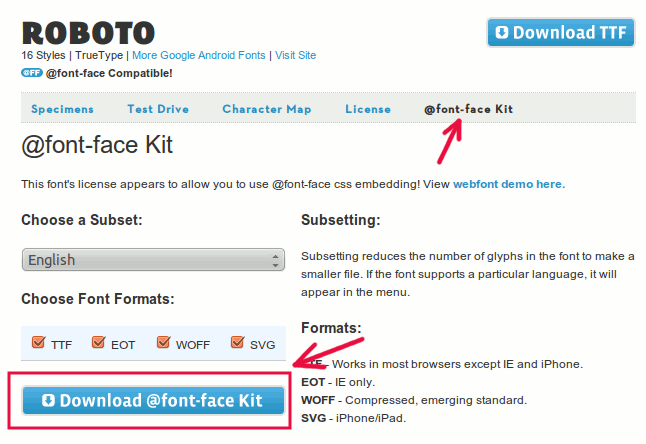
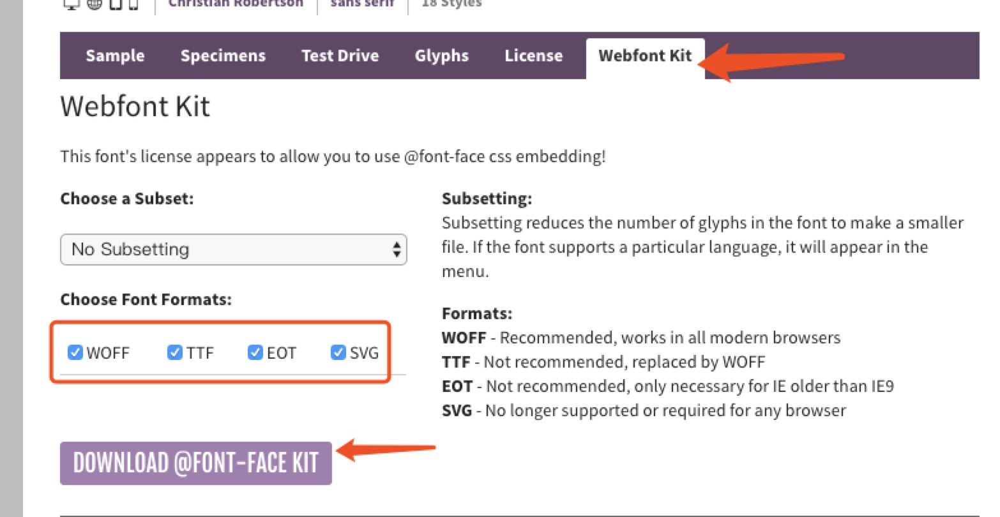

[如何在任何地方使用Google的Roboto字体](https://www.maketecheasier.com/use-google-roboto-font-everywhere/)

"serif"、"sans-serif"、"cursive"、"fantasy"、"monospace"


使用CSS3 @ font-face语法将外部字体嵌入到您的网页中

# 声明

```
@font-face {
	font-family: 'YourWebFontName';
	src: url('YourWebFontName.eot'); /* IE9 Compat Modes */
	src: url('YourWebFontName.eot?#iefix') format('embedded-opentype'), /* IE6-IE8 */
      url('YourWebFontName.woff') format('woff'), /* Modern Browsers */
      url('YourWebFontName.ttf')  format('truetype'), /* Safari, Android, iOS */
      url('YourWebFontName.svg#YourWebFontName') format('svg'); /* Legacy iOS */
}
```

@font-face {
  font-family: 美轮美奂的字体;
  src:url('字体文件1.woff'),  
  url('字体文件2.ttf'),
  url('字体文件3.eot');
}

# 下载字体

***网站：*** 

[FontSquirrel](https://www.fontsquirrel.com/fonts/roboto)

eg: 

***下载roboto字体：*** 

[FontSquirrel Roboto字体页面](https://redirect.viglink.com/?format=go&jsonp=vglnk_151090788487021&key=f33f208bd7d94bed0a23fe052ea3ba17&libId=ja3nh0l10100ohp6000DA177ttuztypumg&loc=https%3A%2F%2Fwww.maketecheasier.com%2Fuse-google-roboto-font-everywhere%2F&v=1&out=http%3A%2F%2Fwww.fontsquirrel.com%2Ffonts%2Froboto&title=%E5%A6%82%E4%BD%95%E5%9C%A8%E4%BB%BB%E4%BD%95%E5%9C%B0%E6%96%B9%E4%BD%BF%E7%94%A8Google%E7%9A%84Roboto%E5%AD%97%E4%BD%93&txt=%3Cfont%20style%3D%22vertical-align%3A%20inherit%3B%22%3E%3Cfont%20style%3D%22vertical-align%3A%20inherit%3B%22%3EFontSquirrel%20Roboto%E5%AD%97%E4%BD%93%E9%A1%B5%E9%9D%A2%3C%2Ffont%3E%3C%2Ffont%3E)

并点击`@font-face Kit` or `Webfont Kit` 链接。下载`@font-face工具包`





***css文件中添加如下代码：***

确保将“src”更改为指向字体文件夹的路径

eg:

```

@font-face {
  font-family: 'roboto-regular';
  src: url('./fonts/Roboto-Regular-webfont.eot');
  src: url('./fonts/Roboto-Regular-webfont.eot?#iefix') format('embedded-opentype'),
          url('./fonts/Roboto-Regular-webfont.woff2') format('woff2'),
          url('./fonts/Roboto-Regular-webfont.woff') format('woff'),
          url('./fonts/Roboto-Regular-webfont.ttf') format('truetype'),
          url('./fonts/Roboto-Regular-webfont.svg#robotoregular') format('svg');
  font-weight: normal;
  font-style: normal;
}

@font-face {
  font-family: 'roboto-bold';
  src: url('./fonts/Roboto-Bold-webfont.eot');
  src: url('./fonts/Roboto-Bold-webfont.eot?#iefix') format('embedded-opentype'),
          url('./fonts/Roboto-Bold-webfont.woff2') format('woff2'),
          url('./fonts/Roboto-Bold-webfont.woff') format('woff'),
          url('./fonts/Roboto-Bold-webfont.ttf') format('truetype'),
          url('./fonts/Roboto-Bold-webfont.svg#robotobold') format('svg');
  font-weight: normal;
  font-style: normal;
}

@font-face {
  font-family: 'Roboto-Light';
  src: url('./fonts/Roboto-Light-webfont.eot');
  src: url('./fonts/Roboto-Light-webfont.eot?#iefix') format('embedded-opentype'),
          url('./fonts/Roboto-Light-webfont.woff2') format('woff2'),
          url('./fonts/Roboto-Light-webfont.woff') format('woff'),
          url('./fonts/Roboto-Light-webfont.ttf') format('truetype'),
          url('./fonts/Roboto-Light-webfont.svg#robotobold') format('svg');
  font-weight: normal;
  font-style: normal;
}
```

***使用：***

```
font-family ：“Roboto” ;
```