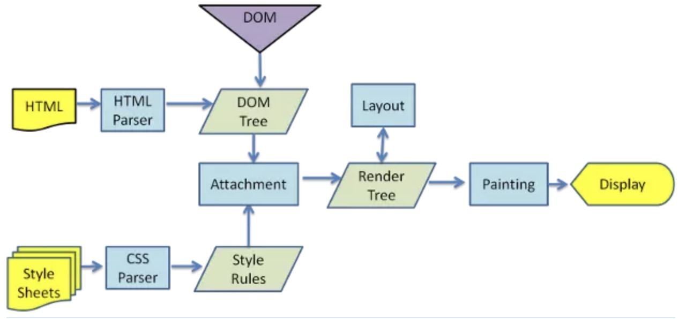

# XSS：跨站脚本攻击

它允许用户将恶意代码植入到提供给其他用户使用的页面中，可以简单的理解为一种javascript代码注入。
XSS的防御措施：

过滤转义输入输出
避免使用eval、new Function等执行字符串的方法，除非确定字符串和用户输入无关
使用cookie的httpOnly属性，加上了这个属性的cookie字段，js是无法进行读写的
使用innerHTML、document.write的时候，如果数据是用户输入的，那么需要对象关键字符进行过滤与转义

### 如何转义？

1. HTML 特殊字符 转义

``` js
function encodeHTML (a) {
  return String(a)
    .replace(/&/g, "&amp;")
    .replace(/</g, "&lt;")
    .replace(/>/g, "&gt;")
    .replace(/"/g, "&quot;")
    .replace(/'/g, "&#39;");
};
```

那么有哪些字符需要转义呢？这里列了一些常见的。

```
" --> &#34;
# --> &#35;
$ --> &#36;
& --> &#38;
' --> &#39;
( --> &#40;
) --> &#41;
; --> &#59;
< --> &#60;
> --> &#62;
```

2. url

如果要对整个 URL 进行转义，使用 `encodeURI`，如果对参数的值进行转义，使用 `encodeURIComponent`。

# CRSF：跨站请求伪造

其实就是网站中的一些提交行为，被黑客利用，在你访问黑客的网站的时候进行操作，会被操作到其他网站上
CRSF防御措施：

检测http referer是否是同域名
避免登录的session长时间存储在客户端中
关键请求使用验证码或者token机制
其他的一些攻击方法还有HTTP劫持、界面操作劫持

### webpack.loader的原理

loaders是你用在app源码上的转换元件。他们是用node.js运行的，把源文件作为参数，返回新的资源的函数。

# let const var 

let声明的全局变量不是全局对象的属性。不可以通过window.变量名的方式访问

# box-sizing的作用

设置CSS盒模型为标准模型或IE模型。标准模型的宽度只包括content，二IE模型包括border和padding


# 创建对象的三种方法

第一种方式，字面量

``` js
var o1 = {name: "o1"}
var o2 = new Object({name: "o2"})
```

第二种方式，通过构造函数

``` js
var M = function(name){ this.name = name }
var o3 = new M("o3")
```

第三种方式，Object.create

``` js
var  p = {name: "p"}
var o4 = Object.create(p)
```

# JS实现继承的几种方式

1. 借用构造函数实现继承

``` js
function Parent2(){
    this.name = "parent2";
    this.play = [1,2,3];
}
function Child2(){
  Parent2.call(this)
  this.type = "child2";
}
```
缺点：Child1无法继承Parent1的原型对象，并没有真正的实现继承（部分继承）

2. 原型链实现继承

``` js
function Parent2(){
    this.name = "parent2";
    this.play = [1,2,3];
}
function Child2(){
    this.type = "child2";
}
Child2.prototype = new Parent2();
```

3. 组合式继承

``` js
function Parent3(){
    this.name = "parent3";
    this.play = [1,2,3];
}
function Child3(){
    Parent3.call(this);
    this.type = "child3";
}
Child3.prototype = Object.create(Parent3.prototype);
Child3.prototype.constructor = Child3;
```

# 当new Foo()时发生了什么

1. 一个继承自 Foo.prototype 的新对象被创建。

2. 使用指定的参数调用构造函数 Foo ，并将 this 绑定到新创建的对象。new Foo 等同于 new Foo()，也就是没有指定参数列表，Foo 不带任何参数调用的情况。

3. 由构造函数返回的对象就是 new 表达式的结果。如果构造函数没有显式返回一个对象，则使用步骤1创建的对象。（一般情况下，构造函数不返回值，但是用户可以选择主动返回对象，来覆盖正常的对象创建步骤）

# fragment (fu ruai men)

document.createDocumentFragment

# DNS预解析

DNS预解析提升页面速度

<meta http-equiv="x-dns-prefetch-control" content="on" />
<link rel="dns-prefetch" href="http://bdimg.share.baidu.com" />

`X-DNS-Prefetch-Control` 头控制着浏览器的 DNS 预读取功能。 DNS 预读取是一项使浏览器主动去执行域名解析的功能，其范围包括文档的所有链接，无论是图片的，CSS 的，还是 JavaScript 等其他用户能够点击的 URL。

因为预读取会在后台执行，所以 DNS 很可能在链接对应的东西出现之前就已经解析完毕。这能够减少用户点击链接时的延迟。

预解析的实现：

1. 打开和关闭 DNS 预读取

用meta信息来告知浏览器, 当前页面要做DNS预解析:`<meta http-equiv="x-dns-prefetch-control" content="on" />`

2. 强制查询特定主机名

在页面header中使用link标签来强制对DNS预解析: `<link rel="dns-prefetch" href="http://bdimg.share.baidu.com" />`


# DNS

浏览器不需要关心DNS解析问题。一台设备上发出URL请求的软件（包括浏览器及其它网络应用软件如：QQ，迅雷），都是只关心网络请求的收发。而DNS的转换是系统去解决的问题。网络请求经过操作系统层的时候，操作系统会去向系统设定的DNS解析服务器，请求DNS解析。


通常情况下，浏览器会把dns解析交给系统来做，hosts文件解析优先于dns解析，你改hosts文件后，立马能体现在浏览器里

**首选DNS和备用DNS？**

DNS只要可以连接,那么就使用主DNS, 当主DNS不可连接,则使用备用DNS. 使用哪个dns和域名是否可以解析没有任何关系.
举个栗子,当主DNS可以连接的时候,访问zhihu.com,主DNS将返回解析结果. 如果主DNS出现问题,http://zhihu.com在服务器上没有记录,此时windows也 不会 去向备用DNS查询. 当且仅当主DNS无法连接时,才会向备用DNS查询.

# 浏览器渲染原理



HTML被解析成DOM Tree，CSS被解析成CSS Rule Tree

把DOM Tree和CSS Rule Tree经过整合生成Render Tree（布局阶段）

元素按照算出来的规则，把元素放到它该出现的位置，通过显卡画到屏幕上

# 前端路由的原理

前端的路由和后端的路由在实现技术上不一样，但是原理都是一样的。在 HTML5 的 history API 出现之前，前端的路由都是通过 hash 来实现的，hash 能兼容低版本的浏览器。

两种实现前端路由的方式

HTML5 History (黑死特瑞)两个新增的API：`history.pushState` 和 `history.replaceState`，
**两个 API 都会操作浏览器的历史记录，而不会引起页面的刷新**。

Hash就是url 中看到 # ,我们需要一个根据监听哈希变化触发的事件( hashchange) 事件。

**用 window.location 处理哈希的改变时不会重新渲染页面**，而是当作新页面加到历史记录中，这样我们跳转页面就可以在 **hashchange 事件**中注册 ajax 从而改变页面内容。

优点
从性能和用户体验的层面来比较的话，后端路由每次访问一个新页面的时候都要向服务器发送请求，然后服务器再响应请求，这个过程肯定会有延迟。而前端路由在访问一个新页面的时候仅仅是变换了一下路径而已，没有了网络延迟，对于用户体验来说会有相当大的提升。

缺点
使用浏览器的前进，后退键的时候会重新发送请求，没有合理地利用缓存。


# DOMContentLoaded与load的区别

DOM文档加载的步骤为

1,解析HTML结构。
2,DOM树构建完成。//DOMContentLoaded
3,加载外部脚本和样式表文件。
4,解析并执行脚本代码。
5,加载图片等外部文件。
6,页面加载完毕。//load

- DOMContentLoaded

DOMContentLoaded顾名思义，就是dom内容加载完毕，从页面空白到展示出页面内容，会触发DOMContentLoaded事件。而这段时间就是HTML文档被加载和解析完成

HTML文档被加载和解析完成？

在这里我们可以明确DOMContentLoaded所计算的时间，当文档中没有脚本时，浏览器解析完文档便能触发 DOMContentLoaded 事件；如果文档中包含脚本，则脚本会阻塞文档的解析，而脚本需要等位于脚本前面的css加载完才能执行。在任何情况下，DOMContentLoaded 的触发不需要等待图片等其他资源加载完成。

- load

页面上所有的资源（图片，音频，视频等）被加载以后才会触发load事件，简单来说，页面的load事件会在DOMContentLoaded被触发之后才触发。

onload事件所有的浏览器都支持，所以我们不需要什么兼容，只要通过调用

DOMContentLoaded不同的浏览器对其支持不同，所以在实现的时候我们需要做不同浏览器的兼容

1）支持DOMContentLoaded事件的，就使用DOMContentLoaded事件；

2）IE6、IE7不支持DOMContentLoaded，但它支持onreadystatechange事件，该事件的目的是提供与文档或元素的加载状态有关的信息。

3)  更低的ie还有个特有的方法doScroll， 通过间隔调用：document.documentElement.doScroll("left");

  可以检测DOM是否加载完成。 当页面未加载完成时，该方法会报错，直到doScroll不再报错时，就代表DOM加载完成了。该方法更接近DOMContentLoaded的实现。

``` js
function ready(fn){

    if(document.addEventListener) {
        document.addEventListener('DOMContentLoaded', function() {
            document.removeEventListener('DOMContentLoaded',arguments.callee, false);
            fn();
        }, false);
    } 

    // 如果IE
    else if(document.attachEvent) {
        // 确保当页面是在iframe中加载时，事件依旧会被安全触发
        document.attachEvent('onreadystatechange', function() {
            if(document.readyState == 'complete') {
                document.detachEvent('onreadystatechange', arguments.callee);
                fn();
            }
        });

        // 如果是IE且页面不在iframe中时，轮询调用doScroll 方法检测DOM是否加载完毕
        if(document.documentElement.doScroll && typeof window.frameElement === "undefined") {
            try{
                document.documentElement.doScroll('left');
            }
            catch(error){
                return setTimeout(arguments.callee, 20);
            };
            fn();
        }
    }
};
```

timeline蓝色竖线所处的时间为`domComplete`时间，红色竖线为dom的`onload`时间，由此可见两种事件的差异。
而浏览器构建dom树所花费的时间可以算出即domComplete时间 减去 html下载完成后的时间。


# Restful API是什么

Restful的意思就是表现层状态转化。

“表现层”其实指的是”资源”（Resources）的”表现层”，把”资源”具体呈现出来的形式，叫做它的”表现层”（Representation）。
所谓”资源”，就是网络上的一个实体，或者说是网络上的一个具体信息。它可以是一段文本、一张图片、一首歌曲、一种服务，总之就是一个具体的实在，每一个URI代表一种资源。
如果客户端想要操作服务器，必须通过某种手段，让服务器端发生”状态转化”（State Transfer）。而这种转化是建立在表现层之上的，所以就是”表现层状态转化”。
Restful就是客户端和服务器之间，传递这种资源的某种表现层
客户端通过四个HTTP动词，对服务器端资源进行操作，实现”表现层状态转化”
Restful API就是符合Restful架构的API设计。

Restful API一些具体实践：

- 应该尽量将API部署在专用域名之下。如果确定API很简单，不会有进一步扩展，可以考虑放在主域名下。

- 应该将API的版本号放入URL。

- 对于资源的具体操作类型，由HTTP动词表示

- 如果记录数量很多，服务器不可能都将它们返回给用户。API应该提供参数，过滤返回结果

- 如果状态码是4xx，就应该向用户返回出错信息。一般来说，返回的信息中将error作为键名
…..

# script标签的defer、async的区别

defer是在HTML解析完之后才会执行，如果是多个，按照加载的顺序依次执行, 执行要在所有元素解析完成之后，DOMContentLoaded 事件触发之前完成

async是在加载完成后立即执行，如果是多个，执行顺序和加载顺序无关

# 跨域通信的几种方式

JSONP
Hash
postMessage
WebSocket
CORS


# 闭包

闭包有什么用，使用场景
当我们需要在模块中定义一些变量，并希望这些变量一直保存在内存中但又不会“污染”全局的变量时，就可以用闭包来定义这个模块。

闭包的缺点
闭包的缺点就是常驻内存，会增大内存使用量，使用不当很容易造成内存泄露。


# 如何进行错误监控

- 前端错误的分类

即时运行错误（代码错误）

资源加载错误

- 错误的捕获方式

1. 即时运行错误的捕获方式：

try…catch； window.onerror

2. 资源加载错误：

object.onerror（如img,script）

performance.getEntries()

Error事件捕获

- 上报错误的基本原理:

采用Ajax通信方式上报
利用Image对象上报

# 跨域的js运行错误可以捕获吗，错误提示什么，应该怎么处理？

可以。
Script error
1.在script标签增加crossorigin属性
2.设置js资源响应头Access-Control-Allow-Orgin:*


# 深拷贝实现方式

``` js
function clone( o ) {
    var temp = {};
    for( var k in o ) {
        if( typeof o[ k ] == 'object' ){
             temp[ k ] = clone( o[ k ] );
        } else {
             temp[ k ] = o[ k ];
        }
    }
    return temp;
}
```

# 如何快速合并雪碧图

Gulp：gulp-css-spriter

webpack：optimize-css-asset

# UTF-8和Unicode的区别


# 如何自定义事件

var eve = new Event('自定义事件名');
ev.addEventListener('自定义事件名', function(){
    console.log('自定义事件')
});
ev.dispatchEvent(eve);

CustomEvent，还可以指定参数

# Event对象常见应用

event.preventDefault()，阻止默认行为
event.stopPropagation()，阻止事件冒泡
event.stopImmediatePropagation()，阻止剩余的事件处理函数执行并且防止事件冒泡到DOM树上，这个方法不接受任何参数。
event.currentTarget，返回绑定事件的元素
event.target，返回触发事件的元素

# CDN

CDN本质仍然是一个缓存，而且将数据缓存在离用户最近的地方，使用户以最快的速度获取数据。


# 判断数组

``` js
var a = []; 
// 1.基于instanceof 
a instanceof Array; 
// 2.基于constructor 
a.constructor === Array; 
// 3.基于Object.prototype.isPrototypeOf 
Array.prototype.isPrototypeOf(a); 
// 4.基于getPrototypeOf 
Object.getPrototypeOf(a) === Array.prototype; 
// 5.基于Object.prototype.toString 
Object.prototype.toString.apply(a) === '[object Array]';
// 6.Array.isArray
Array.isArray([]); // true

```

# UTF-8和Unicode的区别

UTF-8就是在互联网上使用最广的一种unicode的实现方式。
Unicode的出现是为了统一地区性文字编码方案，为解决unicode如何在网络上传输的问题，于是面向传输的众多 UTF（UCS Transfer Format）标准出现了，顾名思义，UTF-8就是每次8个位传输数据，而UTF-16就是每次16个位。
ASCII –> 地区性编码（GBK） –> Unicode –> UTF-8


https://juejin.im/entry/59b3b5ecf265da0652707150