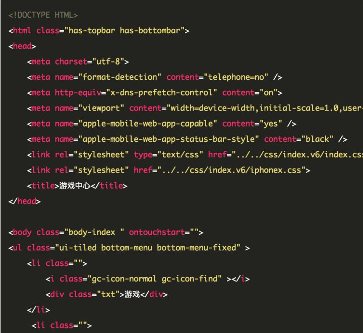

iPhone X 适配 手Q H5页面通用解决方案
======

https://zhuanlan.zhihu.com/p/30840440


# 概要

- 通栏页面

  - 顶部通栏: 对于通栏页面在页面顶部增加一层高度44px的黑色适配层，整个页面往下挪44px。
  - 底部 Tab 栏 / 操作栏: 在页面底部增加一层高度34px的适配层，将操作栏上移34px，颜色可以自定义。

- 非通栏页面

  - 底部 Tab 栏 / 操作栏: 在页面底部增加一层高度34px的颜色块，将操作栏上移34px，颜色可以自定义

- 安全区域

  - 非通栏页面

    非通栏下的页面内容是通到底部的，而按钮(`bottom: 0`)却是在安全区域上；
    这个问题涉及到安全区域，iOS11 和先前版本的不同之处在于，webview 比较重视安全区域了。这意味着，如果给页面元素设置 top: 0, 它会渲染在屏幕顶部的44px之下，也就是状态栏下面。如果给页面元素设置 bottom: 0, 它会渲染在屏幕底部的34px之上，也就是底部安全区域上面。

    解决方案： 设置 viewport 的 meta 标签

  - 通栏页面

- WKWebView vs UIWebView

- 解决方法

  - web 方案

  - 终端 方案


# 详解

### 通栏页面

- 顶部通栏: 对于通栏页面在页面顶部增加一层高度44px的黑色适配层，整个页面往下挪44px。

- 底部 Tab 栏 / 操作栏: 在页面底部增加一层高度34px的适配层，将操作栏上移34px，颜色可以自定义。

### 非通栏页面

- 底部 Tab 栏 / 操作栏: 在页面底部增加一层高度34px的颜色块，将操作栏上移34px，颜色可以自定义

### 安全区域


- 非通栏页面

非通栏下的页面内容是通到底部的，而按钮(`bottom: 0`)却是在安全区域上；
这个问题涉及到安全区域，iOS11 和先前版本的不同之处在于，webview 比较重视安全区域了。这意味着，如果给页面元素设置 top: 0, 它会渲染在屏幕顶部的44px之下，也就是状态栏下面。如果给页面元素设置 bottom: 0, 它会渲染在屏幕底部的34px之上，也就是底部安全区域上面。

解决方案： 设置 viewport 的 meta 标签

viewport 可以设置的选项就是 `viewport-fit`, 它有三个可选值：

  - `contain`: The viewport should fully contain the web content. 可视窗口完全包含网页内容

  - `cover`: The web content should fully cover the viewport. 网页内容完全覆盖可视窗口

  - `auto`: The default value, 同contain的作用


- 通栏页面

设置了viewport-fit的属性，可能并会不生效

原因可能是：终端对于 WebView 通栏的情况设置了UIScrollViewContentInsetAdjustmentNever属性，去除了上下安全区域的边距，使得安全区域的上下边距失效了


**另外*：*经过 2 个版本的 webview（WKWebView VS UIWebView） 测试，发现 WKWebView 在渲染页面的时候，底部按钮在位置表现上不一致，可能是一个还未解决的 bug：

eg:


**WKWebView VS UIWebView**

[WKWebView VS UIWebView](https://www.jianshu.com/p/49f89c4510c1)

UIWebView 是苹果在 iOS 2 之后推出的，WKWebView是苹果在 iOS 8 中推出的新框架，相比UIWebView来说，WKWebView 性能好，速度快，内存小，功能多，且支持了更多的 HTML5 特性


### 

**使用web方案**

根据以上的设计方案，可以这样处理：

1. 修改页面 viewport-fit 属性
2. 在 H5 页面链接一个 iphonex.css 来给 iPhone X 访问的页面增加对应的适配层
3. 在 H5 页面上给对应的 dom 结构加上适配的类名

``` css
@media only screen and (device-width: 375px) and (device-height: 812px) and (-webkit-device-pixel-ratio: 3) {
  /* 增加顶部适配层 */
  .has-topbar {
    height: 100%;
    box-sizing: border-box;
    padding-top: 44px;
    &:before {
      content: '';
      position: fixed;
      top: 0;
      left: 0;
      width: 100%;
      height: 44px;
      background-color: #000000;
      z-index: 9998;
    }
  }
  /* 增加底部适配层 */
  .has-bottombar {
    height: 100%;
    box-sizing: border-box;
    padding-bottom: 34px;
    &:after {
      content: '';
      position: fixed;
      bottom: 0;
      left: 0;
      width: 100%;
      height: 34px;
      background-color: #f7f7f8;
      z-index: 9998;
    }
  }
  /* 导航操作栏上移 */
  .bottom-menu-fixed {
    bottom: 34px;
  }
}
```
html eg:



带来的问题：

1. 要修改的页面非常多，而且给页面带来了额外的类名，对以后的样式移除也有一定的工作量。
2. 使用样式给页面顶部增加适配层，下拉页面的时候黑色适配层会跟着一起移动

**使用终端方案**

原生界面初始化的时候增加适配层

详情查看[这里](https://zhuanlan.zhihu.com/p/30840440)

