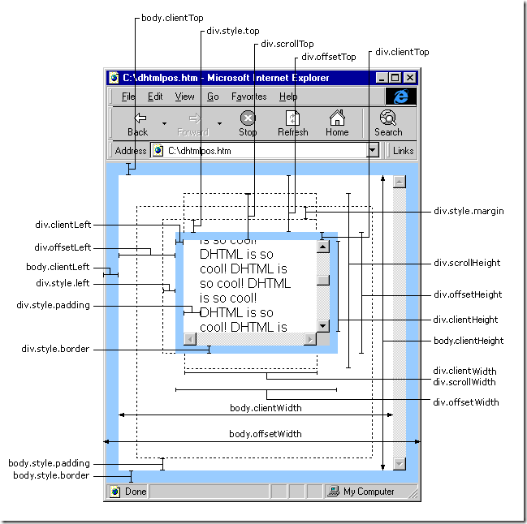

# 图解




# 原生js

```js
document.body.clientWidth // 网页可见区域宽[仅针对body]
document.body.clientHeight // 网页可见区域高[仅针对body]

document.body.offsetWidth // 网页可见区域宽[仅针对body] (包括滚动条和边框，若滚动条和边框为0，则和clientWidth相等)
document.body.offsetHeight // 网页可见区域高[仅针对body](包括滚动条和边框，若滚动条和边框为0，则和clientHeight相等)

window.innerWidth // 可视窗口宽度(包括滚动轴宽度) IE9+、Chrome、Firefox、Opera 以及 Safari
window.innerHeight // 可视窗口高度，不包括浏览器顶部工具栏 IE9+、Chrome、Firefox、Opera 以及 Safari

document.body.scrollWidth // 网页正文全文宽(不包括滚动轴的宽度)
document.body.scrollHeight // 网页正文全文高
//假如网页中没有滚动轴，document.body.scrollWidth和window.innerWidth相等，document.body.scrollHeight和window.innerHeight相等。

document.body.scrollTop // 网页被卷去的高
document.body.scrollLeft // 网页被卷去的左

window.screenTop // 网页正文部分上
window.screenLeft // 网页正文部分左

window.screen.height // 屏幕分辨率的高（整个屏幕的高度）
window.screen.width // 屏幕分辨率的宽（整个屏幕的宽度）

window.screen.availHeight // 屏幕可用工作区高度
window.screen.availWidth // 屏幕可用工作区宽度

window.outerHeight // 整个浏览器可用工作区高度
window.outerWidth // 整个浏览器可用工作区宽度

scrollHeight // 获取对象的滚动高度
scrollWidth // 获取对象的滚动宽度 

scrollLeft // 设置或获取位于对象左边界和窗口中目前可见内容的最左端之间的距离 
scrollTop // 设置或获取位于对象最顶端和窗口中可见内容的最顶端之间的距离 

offsetHeight // 获取对象相对于版面或由父坐标 offsetParent属性指定的父坐标的高度 
offsetLeft //获取对象相对于版面或由 offsetParent属性指定的父坐标的计算左侧位置 
offsetTop //获取对象相对于版面或由offsetParent属性指定的父坐标的计算顶端位置

window.scrollTo(x, y) // 页面滚动方法
```

# jquery

``` js
$(document).height() // 整个网页的高度
$(window).height() // 浏览器可视窗口的高度
$(window).scrollTop() // 浏览器可视窗口顶端距离网页顶端的高度（垂直偏移）

$(window).height() // 浏览器当前窗口可视区域高度
$(window).width() // 浏览器当前窗口可视区域宽度

$(document).width() // 浏览器当前窗口文档对象宽度
$(document).height() // 浏览器当前窗口文档对象高度

$(document.body).height() // 浏览器当前窗口文档body的高度
$(document.body).width() // 浏览器当前窗口文档body的宽度

$(document.body).outerHeight(true) // 浏览器当前窗口文档body的总高度 包括border padding margin
$(document.body).outerWidth(true)) // 浏览器当前窗口文档body的总宽度 包括border padding margin

$(selector).height() // content高度
$(selector).width() // content宽度
$(selector).innerHeight() // content + padding
$(selector).innerWidth() //content + padding
$(selector).outerHeight() // content + padding + border
$(selector).outerWidth() // content + padding + border
$(selector).outerHeight(true) // content + padding + border + margin
$(selector).outerWidth(true) // content + padding + border + margin

$(selector).offset() & $(selector).offset({top: y, left: x}) // 返回或设置匹配元素相对于文档的偏移(位置), 只对可见元素有效
$(selector).offset().top // 匹配元素相对于文档顶端的偏移(位置)
$(selector).offset().left // 匹配元素相对于文档左边的偏移(位置)

$(selector).position().top // 匹配元素与最接近的且绝对定位（`position: relative`）的父元素的相对顶端偏移
$(selector).position().left // 匹配元素与最接近的且绝对定位（`position: relative`）的父元素的相对左边偏移

$(selector).scrollTop() & $(selector).scrollTop(y) // 返回或设置匹配 元素的滚动条 的垂直位置
$(selector).scrollLeft() & $(selector).scrollLeft(x) // 返回或设置匹配 元素的滚动条 的水平位置
```

**注意**

1、zepto.js 没有 `innerHeight()`、`outerHeight()` 方法
2、zepto.js: `$(selector).height() = border + padding + content`