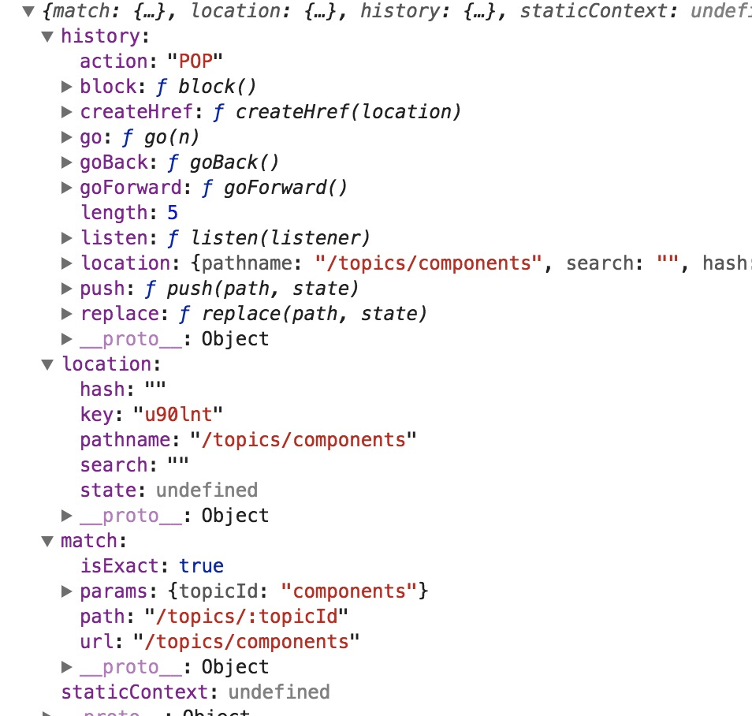

this.props.match
=====


eg: 

```
<!-- http://localhost:3000/topics -->
<!-- console.log(this.props.match) -->

isExact: true,
params: {topicId: "components"},
path: "/topics/:topicId",
url: "/topics/components"
```

一个match对象包含有关如何<Route path>匹配URL的信息。match对象包含以下属性：

- `params` - (object) 从与路径的动态段对应的URL解析的键/值对
- `isExact` - (boolean) tr如果整个URL匹配未`true`（没有结尾字符）
- `path` - (string) 用于匹配的路径模式, 用于构建嵌套的<Route>s: eg: `path: "/topics/:topicId"`
- `url` - (string) URL的匹配部分。用于构建嵌套的<Link>s


You’ll have access match objects in various places:

***你将match在不同的地方访问对象：***

- `Route` component: `this.props.match`
- `Route` render: `({ match }) => ()`
- `Route` children: `({ match }) => ()`
- `withRouter`: `this.props.match`
- `matchPath`: the return value


如果 Route 没有path，因此总是匹配，你会得到最接近的父匹配。同样如此withRouter。