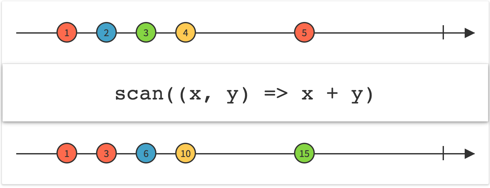

Observable.prototype.scan

连续地对数据序列的每一项应用一个函数，然后连续发射结果

scan

Scan操作符对原始Observable发射的第一项数据应用一个函数，然后将那个函数的结果作为自己的第一项数据发射。
它将函数的结果同第二项数据一起填充给这个函数来产生它自己的第二项数据。它持续进行这个过程来产生剩余的数据序列。这个操作符在某些情况下被叫做accumulator。

scan 操作类似fp中的reduce, 可以累计计算某个值。

scan((acc, item) => newacc)

acc 为上次scan结束时的值，newacc是本次计算的值，并且传入下一个operator.

如果想像reduce一样设置一个起始值，可以在scan之前设置一个startWith(0)

例如我有个事件会输出1,2,3

 myobservable$.scan((acc, item) => acc * item)
     .startWith(1)
     .scan((newacc) => {result: newacc})
     .subscribe(console.log)