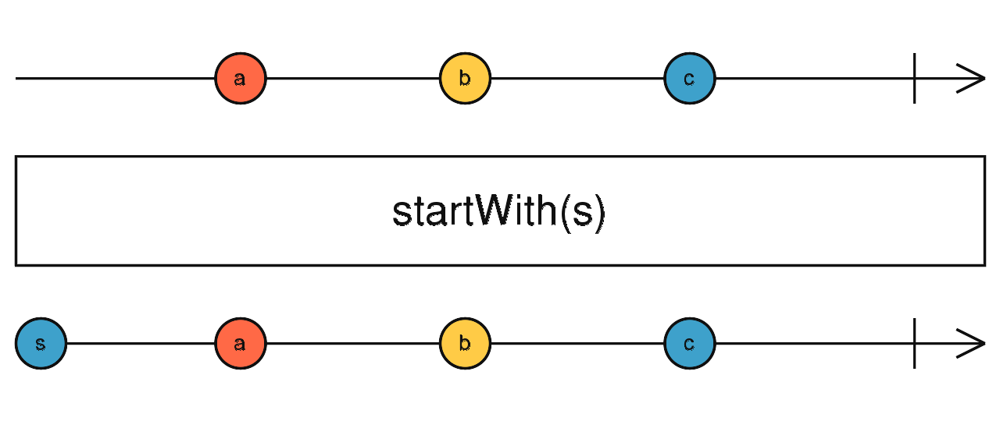

返回的 Observable 会先发出作为参数指定的项，然后再发出由源 Observable 所发出的项
startWith(values: ...T, scheduler: Scheduler): Observable

# 参数

- values
你希望修改过的 Observable 可以先发出的项

- scheduler
用于调度 next 通知发送的 IScheduler 。

# 返回:
Observable	
该 Observable 发出指定的 Iterable 中的项，然后发出由源 Observable 所发出的项。