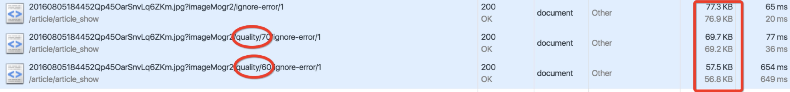
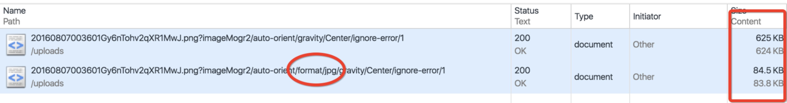

1. 手动处理

网站[tinypng](https://tinypng.com/)，虽然是有损压缩，但压缩效果极好

2. gulp子任务处理

gulp子任务处理的话，推荐使用[gulp-imagemin插件](https://link.juejin.im/?target=https%3A%2F%2Fgithub.com%2Fsindresorhus%2Fgulp-imagemin)，自动化处理，效果也还不错。

``` js
// 图片压缩
gulp.task('images', function() {
    return gulp.src(config.src)
        .pipe(plumber(handleErrors))
        .pipe(newer(config.dest))
        .pipe(logger({ showChange: true }))
        .pipe(imagemin()) // 压缩
        .pipe(gulp.dest(config.dest));
});
```

3. 托管到第三方平台的图片压缩

比如七牛云平台，他们会有一套专门的方案来对图片压缩，格式转换，裁剪等。只需要在url后面加上对应的参数即可，虽然偶尔会有一些小bug，但整体来说，托管方案比用自家应用服务器方案更优。

**改变参数，实现不同程度的压缩:**


4. jpg优化

除了对图片进行压缩之外，对透明图床没有要求的场景，强烈建议将png转换为jpg，效果很明显！
如下图，将png格式化为jpg格式，图片相差差不多8倍！


png转jpg，体积相差八倍, 再次强调，可以转换成jpg的图片，强烈建议转换成jpg！