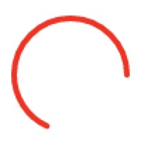

动画

``` html
<svg v-if="!spinner" class="circular" viewBox="25 25 50 50">
  <circle class="path" cx="50" cy="50" r="20" fill="none"/>
</svg>
```

`circle`生成封闭的圆形曲线。使用`stroke-dasharray`属性将会使得虚线类型应用在描边上。

`stroke-dasharray`是一组用逗号分割的数字组成的数列。每一组数字，第一个用来表示的长度，第二个用来表示非填色区域的长度。
`stroke-dashoffset`会对第一段实线的位置进行偏移。

由于圆的周长是 3.14 * 2 * 半径（20），约等于125.6，
`stroke-dasharray: 90, 150;`时，将形成一段`90`的圆形线段，空白区域是35.6（125.6 - 90）

分解`loading-dash` 动画的过程：

``` scss
@keyframes loading-dash {
  0% {
    stroke-dasharray: 1, 200;
    stroke-dashoffset: 0;
  }
  50% {
    stroke-dasharray: 90, 150;
    stroke-dashoffset: -40px;
  }
  100% {
    stroke-dasharray: 90, 150;
    stroke-dashoffset: -120px;
  }
}
```

`stroke-dasharray: 1, 200; stroke-dashoffset: 0;`: `200`的设置实际只需要大于圆周长即可。


`stroke-dasharray: 90, 150; stroke-dashoffset: -40px;`:



`stroke-dasharray: 90, 150; stroke-dashoffset: -120px;`


``` scss
.path {
  animation: loading-dash 1.5s ease-in-out infinite;
  stroke-dasharray: 90, 150;
  stroke-dashoffset: 0;
  stroke-width: 2;
  stroke: $--color-primary;
  stroke-linecap: round;
}
@keyframes loading-dash {
  0% {
    stroke-dasharray: 1, 200;
    stroke-dashoffset: 0;
  }
  50% {
    stroke-dasharray: 90, 150;
    stroke-dashoffset: -40px;
  }
  100% {
    stroke-dasharray: 90, 150;
    stroke-dashoffset: -120px;
  }
}
```

配合`circle`元素的动画旋转`svg`元素就形成了loading动画。如果是自定义loading icon，也是通过这里实现的loading 旋转效果。

``` scss
.circular {
  height: $--loading-spinner-size;
  width: $--loading-spinner-size;
  animation: loading-rotate 2s linear infinite;
}
@keyframes loading-rotate {
  100% {
    transform: rotate(360deg);
  }
}
```

- `body`修饰符: 默认Loading 遮罩会插入到绑定元素的子节点，此修饰符可以使遮罩插入至 DOM 中的 body 上。

- `fullscreen`修饰符: 添加`is-fullscreen`样式类

``` css
.is-fullscreen {
  position: fixed
}
```

- `lock` 修饰符: 父元素滚动锁定，fullscreen状态下锁定了body上滚动

``` js
if (binding.modifiers.fullscreen && binding.modifiers.lock) {
  addClass(parent, 'el-loading-parent--hidden');
}
```

``` css
.el-loading-parent--hidden {
  overflow: hidden!important;
}

```

# 指令实现

``` js
<div
  v-loading="loading2"
  element-loading-text="拼命加载中"
  element-loading-spinner="el-icon-loading"
  element-loading-background="rgba(0, 0, 0, 0.8)"
  element-loading-custom-class="className"
  :data="tableData"
  style="width: 100%">
</div>
```

指令钩子

- el：指令绑定的元素。可以用于直接操作 DOM。

- binding：一个对象，包含以下属性
  - value
  - modifiers
  
- vnode：由 Vue 编译器(Vue’s compiler)生成的虚拟 Node 节点(virtual node)


zIndex 管理

给el初始化一个`maskStyle = {}`, 保存index：`el.maskStyle.zIndex = PopupManager.nextZIndex();`


`fullscreen`修饰符实现: `is-fullscreen`

`body`修饰符实现: 将loadingDom插入到body中，并

[`getBoundingClientRect`](https://developer.mozilla.org/zh-CN/docs/Web/API/Element/getBoundingClientRect)
方法返回元素的大小及其相对于视口的位置。

[getBoundingClientRect](./img/getBoundingClientRect.jpeg)

DOMRect 对象包含了一组用于描述边框的只读属性——left、top、right和bottom，单位为像素。除了 width 和 height 外的属性都是相对于视口的左上角位置而言的

空边框盒（没有内容的边框）会被忽略。如果所有的元素边框都是空边框，那么这个矩形给该元素返回的 width、height 值为0，left、top值为第一个css盒子（按内容顺序）的top-left值。


核心问题需要获取绑定指令元素相对于整个网页左上角定位的属性值。通过`getBoundingClientRect`获取到了相对视口的位置，
如果页面滚动，就需要考虑`scrollTop`、`scrollLeft`值怎么获得？

以`scrollTop`为例，由于不同浏览器下获取`scrollTop`的方式不一致，可能是`scrollTop``document.body.scrollTop`，也可能是`document.documentElement.scrollTop`。具体使用哪个呢？
`document.body.scrollTop`与`document.documentElement.scrollTop`两者有个特点，就是同时只会有一种会生效。比如`document.body.scrollTop`能取到值的时候，`document.documentElement.scrollTop`就会始终为 0；反之亦然。

因为这个特点，所以 `var scrollTop = document.body.scrollTop+document.documentElement.scrollTop;`


``` js
if (binding.modifiers.body) {
  el.originalPosition = getStyle(document.body, 'position');

  ['top', 'left'].forEach(property => {
    const scroll = property === 'top' ? 'scrollTop' : 'scrollLeft';
    el.maskStyle[property] = el.getBoundingClientRect()[property] +
      document.body[scroll] +
      document.documentElement[scroll] -
      // 这里为何要减 body的 margin-top
      parseInt(getStyle(document.body, `margin-${ property }`), 10) +
      'px';
  });
  ['height', 'width'].forEach(property => {
    el.maskStyle[property] = el.getBoundingClientRect()[property] + 'px';
  });

  insertDom(document.body, el, binding);
} else {
  el.originalPosition = getStyle(el, 'position');
  insertDom(el, el, binding);
}
```

# 

el上添加的属性

- `el.instance`: `el.instance = mask;`

``` js
  const Mask = Vue.extend(Loading);
  const mask = new Mask({
    el: document.createElement('div'),
    // 通过element-loading-xx添加的属性
    data: {
      text: vm && vm[textExr] || textExr,
      // ... 
    }
  })
```

- `el.instance.hiding`: 判断是否正在隐藏loading。

当`binding.value`为`false`时，`hiding`为true，表示正在做隐藏loading操作，完成后`hiding`设置为false

- `el.mask`: `mask.$el` loading容器元素，不是添加指令的元素

- `el.maskStyle`：初始为`{}`, loading mask相关style属性

insert dom之前可能添加`top`, `left` `height` `width` `zIndex`属性，供insertDom方法中使用

- `el.originalPosition`: 指令元素的position值
- `el.originalOverflow`: 指令元素的overflow值

- `el.domVisible`： dom是否是可显示状态， `afterLeave`回调时会置为false, 

初始为undefined, 通过判断`!el.domVisible && getStyle(el, 'display') !== 'none' && getStyle(el, 'visibility') !== 'hidden'`后,`parent.appendChild(el.mask);`之前设置为true

- `el.domInserted`: 是否插入

# 结束操作

1. 当`binding.value`为`false`时，`toggleLoading`方法内

- 执行`afterLeave`，给`instance = new Mask()`注册了`after-leave`事件，回调是一些组件附加到父容器的样式清理，设置`hiding`为`false`

- 设置 `el.instance.visible = false;`

2. `<transition @after-leave="handleAfterLeave">`将触发`after-leave`钩子，执行`this.$emit('after-leave');`

3. `afterLeave`中instance注册的`after-leave`被触发，完成清理工作。


``` js
afterLeave(el.instance, _ => {
  el.domVisible = false;
  const target = binding.modifiers.fullscreen || binding.modifiers.body
    ? document.body
    : el;
  removeClass(target, 'el-loading-parent--relative');
  removeClass(target, 'el-loading-parent--hidden');
  el.instance.hiding = false;
}, 300, true);
el.instance.visible = false;
el.instance.hiding = true

// afterLeave
function afterLeave(instance, callback, speed = 300, once = false) {
  if (!instance || !callback) throw new Error('instance & callback is required');
  let called = false;
  const afterLeaveCallback = function() {
    if (called) return;
    called = true;
    if (callback) {
      callback.apply(null, arguments);
    }
  };
  if (once) {
    instance.$once('after-leave', afterLeaveCallback);
  } else {
    instance.$on('after-leave', afterLeaveCallback);
  }
  setTimeout(() => {
    afterLeaveCallback();
  }, speed + 100);
};
```


# 以服务的方式条用

``` js
import { Loading } from 'element-ui';
Loading.service(options);
```