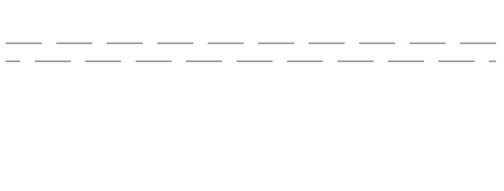

# Progress 进度条

- 线性进度条 line

整体结构分outerbar与innerbar, 设置`innerbar`的width为百分比实现进度条百分比效果。

``` html
<div class="el-progress-bar" v-if="type === 'line'">
  <div class="el-progress-bar__outer" :style="{height: strokeWidth + 'px'}">
    <div class="el-progress-bar__inner" :style="barStyle">
      <div class="el-progress-bar__innerText" v-if="showText && textInside">{{percentage}}%</div>
    </div>
  </div>
</div>
```

- 环形进度条 circle


``` html
<div class="el-progress-circle" :style="{height: width + 'px', width: width + 'px'}" v-else>
  <svg viewBox="0 0 100 100">
    <path class="el-progress-circle__track" :d="trackPath" stroke="#e5e9f2" :stroke-width="relativeStrokeWidth" fill="none"></path>
    <path class="el-progress-circle__path" :d="trackPath" stroke-linecap="round" :stroke="stroke" :stroke-width="relativeStrokeWidth" fill="none" :style="circlePathStyle"></path>
  </svg>
</div>
```

svg viewport设置？

<svg width="500" height="300"></svg>

在最外层<svg>元素上使用width和height属性声明视窗尺寸(`viewport`)
表示SVG可见区域的大小，或者可以想象成舞台大小，画布大小。

<svg width="500" height="300"></svg>
viewport

`viewBox="x, y, width, height"`: x:左上角横坐标，y:左上角纵坐标，width:宽度，height:高度

viewBox顾名思意是“视区盒子”的意思。更形象的理解：SVG就像是我们的显示器屏幕，viewBox就是截屏工具选中的那个框框，`x, y, width, height`分别表示截图的起始点和截图的宽高。
最终的呈现就是把截图框框中的截屏内容再次在显示器中全屏显示。具体原理步骤的分步效果可以看这里[这里](http://www.zhangxinxu.com/study/201408/svg-viewbox-explain.html)

`viewBox`详细了解看[这里](http://www.zhangxinxu.com/wordpress/2014/08/svg-viewport-viewbox-preserveaspectratio/)


[path](https://developer.mozilla.org/zh-CN/docs/Web/SVG/Tutorial/Paths)

path元素的形状是通过属性d定义的，属性d的值是一个“命令+参数”的序列: `<path d="M10 10 H 90 V 90 H 10 L 10 10"/>`是一个80px的正方形

常用命令：

`M x y` M命令是移动画笔位置，但是不画线; 比如`<path d="M10 10"/>`

`L x y (or l dx dy)`: L命令将会在当前位置和新位置（L前面画笔所在的点）之间画一条线段

`H x (or h dx)`、`V y (or v dy)`: H，绘制平行线。V，绘制垂直线

`Z (or z)`: 闭合路径命令, Z命令会从当前点画一条直线到路径的起点，尽管我们不总是需要闭合路径，但是它还是经常被放到路径的最后

`C x1 y1, x2 y2, x y (or c dx1 dy1, dx2 dy2, dx dy)`: 创建三次贝塞尔曲线

`T x y (or t dx dy)`: 创建二次贝塞尔曲线

`A rx ry x-axis-rotation large-arc-flag sweep-flag x y` 弧形命令A是另一个创建SVG曲线的命令。基本上，弧形可以视为圆形或椭圆形的一部分。

`rx`:x轴半径
`ry`: y轴半径
`x-axis-rotation`: 表示弧形的旋转情况
`large-arc-flag`: 角度大小,决定弧线是大于还是小于180度，0表示小角度弧，1表示大角度弧。
`sweep-flag`: 弧线方向: 弧线的方向，0表示从起点到终点沿逆时针画弧，1表示从起点到终点沿顺时针画弧
`x`: 弧形的终点x坐标
`y`: 弧形的终点y坐标


``` html
<svg width="325px" height="325px">
  <path d="M80 80
           A 45 45, 0, 0, 0, 125 125
           L 125 80 Z" fill="green"/>
  <path d="M230 80
           A 45 45, 0, 1, 0, 275 125
           L 275 80 Z" fill="red"/>
  <path d="M80 230
           A 45 45, 0, 0, 1, 125 275
           L 125 230 Z" fill="purple"/>
  <path d="M230 230
           A 45 45, 0, 1, 1, 275 275
           L 275 230 Z" fill="blue"/>
</svg>
```

了解以上之后再看源码就知道如何画一个弧线：

``` html
<path class="el-progress-circle__track" :d="trackPath" stroke="#e5e9f2" :stroke-width="relativeStrokeWidth" fill="none"></path>
<path class="el-progress-circle__path" :d="trackPath" stroke-linecap="round" :stroke="stroke" :stroke-width="relativeStrokeWidth" fill="none" :style="circlePathStyle"></path>
```

`stroke-width`: 弧线的宽度

`stroke`: 弧线颜色

`stroke-linecap`: 线端点的形态，`round`是圆滑的端点。

`stroke-linecap`: 用来控制边框终点的形状。有以下值：

`butt`用直边结束线段，它是常规做法，线段边界90度垂直于描边的方向、贯穿它的终点。
`square`的效果差不多，但是会稍微超出实际路径的范围，超出的大小由stroke-width控制。
`round`表示边框的终点是圆角，圆角的半径也是由stroke-width控制的

示例可看[这里](https://codepen.io/pen/)

`fill`: 设置弧线两端点连接后形成的封闭图片内部的填充色，`none`即无填充

`d`: 绘制路径的一系列`命令+参数`的序列

绘制圆形的序列(`d`)代码,：

``` js
relativeStrokeWidth() {
  return (this.strokeWidth / this.width * 100).toFixed(1);
},
trackPath() {
  const radius = parseInt(50 - parseFloat(this.relativeStrokeWidth) / 2, 10);
  return `
    M 50 50
    m 0 -${radius}
    a ${radius} ${radius} 0 1 1 0 ${radius * 2}
    a ${radius} ${radius} 0 1 1 0 -${radius * 2}`;
},
```

**计算圆形半径：**

在此之前需要计算出相对的弧线宽度：

由于我们是使用一个`100px`的视区内描绘路径，然后使用svg`viewBox`属性将`100 * 100`的区域扩展放大到实际`width * width`。
所以组件`strokeWidth`的弧线宽度在100px里的宽度就是`relativeStrokeWidth`的计算方法。

圆形半径就是100px的视区的一半减去弧线宽度的一半: `const radius = parseInt(50 - parseFloat(this.relativeStrokeWidth) / 2, 10);`

**绘制圆形弧线：**

tip: 命令可以使用大写字母，你也可以使用这些命令的相对坐标形式来绘制相同的图形，相对命令使用的是*小写字母*，它们的参数不是指定一个明确的坐标，而是表示相对于它前面的点需要移动多少距离。

一共四个步骤：

`M 50 50`: 设置画笔位置为圆心

`m 0 -${radius}`: 一个圆形有上下左右四个顶点，这里是以圆心为相对位置找到上方顶点作为弧线的起始位置。

`a ${radius} ${radius} 0 1 1 0 ${radius * 2}`: 圆形上顶点到下顶点顺时针画了个半圆弧线

`a ${radius} ${radius} 0 1 1 0 -${radius * 2}`: 圆形下顶点到上顶点顺时针画剩下的半圆

**实现圆弧百分比显示：**

```html
<path class="el-progress-circle__path" :d="trackPath" stroke-linecap="round" :stroke="stroke" :stroke-width="relativeStrokeWidth" fill="none" :style="circlePathStyle"></path>
```

这里就需要使用`stroke-dasharray`、`stroke-dashoffset`两个样式属性，先了解一下：

`stroke-dasharray`： 将虚线类型应用在描边。是一组用逗号分割的数字组成的数列。如

每一组数字，第一个用来表示的长度，第二个用来表示非填色区域的长度。`stroke-dasharray="50,20"`就是实线为50,两实现间空白间隙为20的虚线。

如果我们希望将这段虚线向前偏移一些30px，那么第一段实线和第一段非填充区域的长度都将是20px，使用`stroke-dashoffset="30"`即可以做到。

``` html
<path d="M 10 75 L 690 75" stroke="black"
    stroke-linecap="round" stroke-dasharray="50,20" fill="none"/>
  <path d="M 10 100 L 690 100" stroke="black"
    stroke-linecap="round" stroke-dasharray="50,20" stroke-dashoffset="30" fill="none"/>
```



所以我们可以想到圆环就是一段弯曲的弧线，将虚线类型应用上去，填色区域和非填色区域的长度就是圆的周长。
圆形进度条是100%`stroke-dashoffset`为0，`stroke-dashoffset`为 `90% * 周长`时，进度条就是10%的长度。

``` js
perimeter() {
  const radius = 50 - parseFloat(this.relativeStrokeWidth) / 2;
  return 2 * Math.PI * radius;
},
circlePathStyle() {
  const perimeter = this.perimeter;
  return {
    strokeDasharray: `${perimeter}px,${perimeter}px`,
    strokeDashoffset: (1 - this.percentage / 100) * perimeter + 'px',
    transition: 'stroke-dashoffset 0.6s ease 0s, stroke 0.6s ease'
  };
},
```


